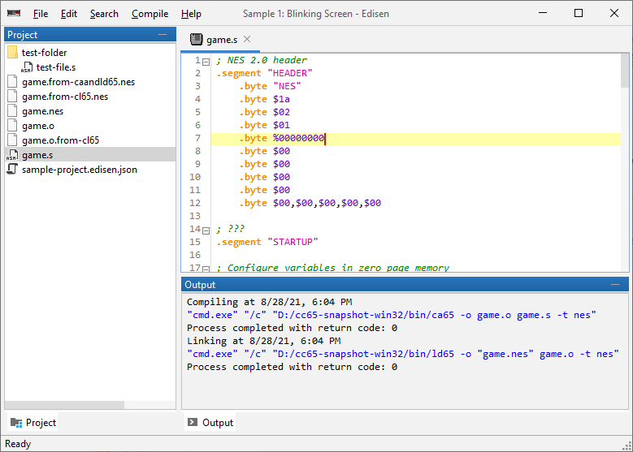

# edisen


[](https://codecov.io/gh/bobbylight/Edisen)

The beginnings of a simple NES IDE.



## Compiling
`Edisen` requires Java 14 or later to compile and run.

```bash
./gradlew clean build --warning-mode all
```

## Building the Native Applications
`Edisen` packages are available for both Windows and Mac.

### Windows
[launch4j](http://launch4j.sourceforge.net/) is used to generate an executable.
Configure launch4j's location in `settings.gradle` before running the following
command:

```bash
./gradlew clean generateWindowsStarterExe

# Running the built application:
./build/install/edisen/edisen.exe
```

### Mac
On Macs, an app bundle and DMG image are both generated with the standard JDK
tools, so no third-party library is necessary:

```bash
./gradlew clean generateMacApp

# Either mount the built DMG manually or run this command:
hdiutil attach ./build/install/Edisen-1.0.0.app
```

## What's Done
This is still early days, and currently the scaffolding is being worked on.
It's not really usable just yet to build games, but is good to whet
appetites.

* The shell of a syntax highlighting code editor.
* A basic project configuration

## Progress
Check the [issues page](https://github.com/bobbylight/Edisen/issues)
for progress on features, bugs, etc.
